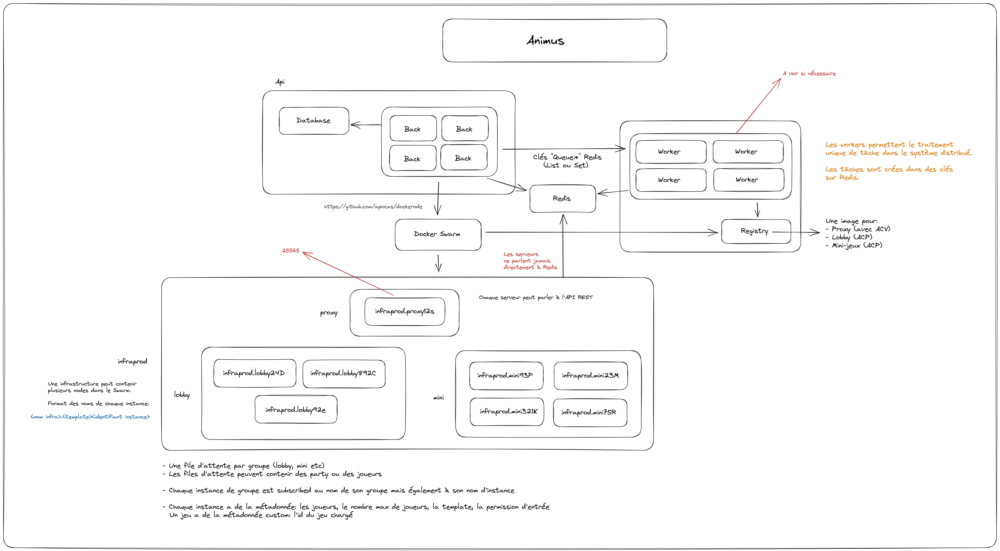

# Animus

Composant de gestion globale du serveur Efrei Craft.
Celui a pour vocation de gérer :

- Les joueurs
  - Consultation d'informations
    - Dernière connexion
    - Première connexion
    - Grades
  - Gestion des permissions personnelles
    - Ajout
    - Suppression
    - Consultation
- Les grades
- Les sanctions
- Les jeux
  - Jeux disponibles
  - Création, modification et suppression de jeux :
    - Nom du jeu
    - Couleur du jeu
    - Description du jeu
    - Item du jeu
    - File d'attente minimum pour lancer une partie
    - Nombre de joueurs maximum par partie
    - Nombre de joueurs minimum par partie
    - Template de lancement de partie
    - Nombre minimum de serveurs pour le jeu
    - Nombre maximum de serveurs pour le jeu
- Les serveurs dynamiques
  - Possibilité de créer des serveurs dynamiques
  - Gestion des templates
  - Exécution de commandes

L'idée serait de passer la majorité des fonctionnalités de Servo à ECAPI.

## Schéma de l'infrastructure



## Diagramme Entité-Relation


## Setup d'un environnement de développement

Pour configurer & lancer votre environnement de développement local :

1. Docker & Docker Compose doivent être installés ([ici](https://www.docker.com/products/docker-desktop))
2. Ce repo doit être cloné
3. `.env.local.example` doit être copié et renommé en `.env.local`
4. Les dépendances du repo doivent être installées pour l'IDE (`npm install`)

Une fois ces étapes complétées, l'environnement peut être lancé avec la commande `docker-compose up -d`.

## Architecture

Le back-end utilise :

- NodeJS pour le runtime
- Fastify pour le serveur HTTP
  - REST pour le mode de communication
  - Swagger pour la documentation
- PostgreSQL pour la base de données
- Prisma pour la gestion de la base de données

### Back-end

#### Database

Il est possible de parler directement à la base de données avec le CLI de PostgreSQL :

```bash
docker compose exec db psql -U postgres
```

Pour interagir avec la librairie Prisma à l'intérieur du conteneur de développement, il faut utiliser la commande suivante :

```bash
docker compose exec back npx prisma
```

Le CLI de Prisma nous permettra d'effectuer des migrations de base de données, de valider le schema etc.

Plus d'informations sur Prisma [ici](https://www.prisma.io/docs/).

**Important:** La commande `npm run prisma:dev:migrate` doit être exécutée à chaque fois que vous voulez mettre à jour le schéma de la base de données. La commande vous créera une migration et l'appliquera à la base de données au déploiement.

Vous pouvez également remplir la BDD avec des données de test en exécutant la commande `npm run prisma:dev:seed`.

### Front-end

La techno pour le front-end n'a pas encore été décidée.

## Déployer en production

L'image de production est construite à partir du Dockerfile de production (`Dockerfile.prod`) et est publiée sur le registry Docker `docker.nexus.jiveoff.fr` (de façon temporaire).

La composition des services en production est définie dans le fichier `docker-compose.prod.yml`.
